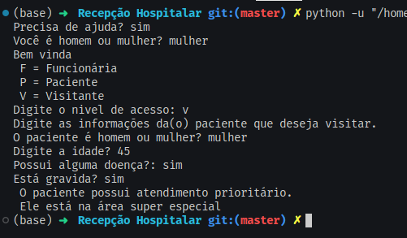
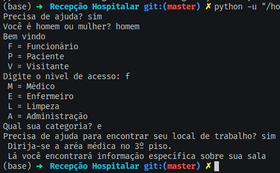

# PROGRAMA PARA RECEPÇÃO EM HOSPITAIS

## Python

 Trata-se de um questionário que tem a função de informar funcionários, pacientes e visitantes suas respectivas áreas dentro do hospital.

 

Saida:

 
        
    

